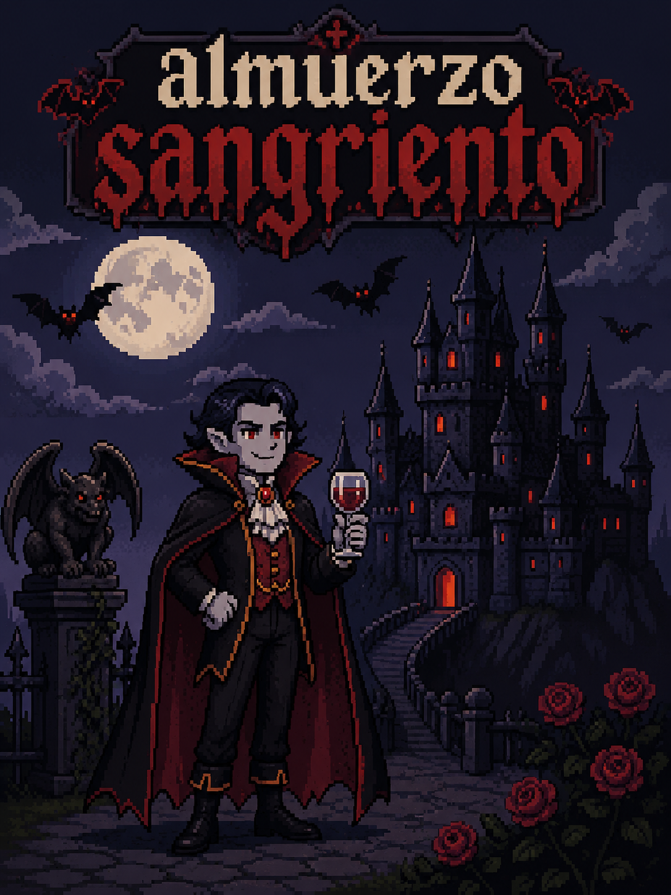

# UNIVERSIDAD NACIONAL DEL LITORAL
## Facultad de Ingeniería y Ciencias Hídricas
### Tecnicatura en Diseño y Programación de Videojuegos
**Proyecto Final**

---

# GAME DESIGN DOCUMENT (GDD)

**Nombre del Juego:** Almuerzo sangriento  
**Versión:** 1.2.5  
**Fecha de actualización:** 21/07/2026

## Ficha del Grupo
| Apellido y Nombre Completo | Función dentro del grupo |
| :--- | :--- |
| Angel Rios | Game Designer / Level Design |
| Angel Rios | Artist |
| Angel Rios | Programmer |
| Angel Rios | Producer |

---

## 1. High Concept y Visión Inicial

**High Concept:** Juego de sigilo Topdown Dungeon Crawler, donde un vampiro debe infiltrarse a varios castillos, asesinar a los guardias sin ser visto, usando y controlando el ambiente a su favor, evitando la luz del sol, para llegar al miembro real y devorarlo.

---

## 2. Estructura Core del Proyecto

### 2.1 Objetivo del Proyecto
El proposito educativo de este proyecto, es aprender a llevar acabo una idea simple y convertirla en un proyecto rentable y deseado por los jugadores. En cuanto al proposito como producto, mi videojuego busca demostrar que no se necesita un concepto gigante ni un equipo triple A para crear un buen producto.

### 2.2 Diseño e investigación
- **Definición de idea:** El jugador, encarnando a un vampiro, jugara varios niveles donde se desplazara del punto A al punto B, evitando ser descubierto por los enemigos, este dispone de sombras y muebles para cortar la vision de los guardias, estos muebles, que el usuario puede controlar mentalmente usando el mouse, tambien sirven para obstruir el otro obstaculo presente, la luz del sol. Al completar 10 niveles, donde alcanzo su objetivo de eliminar a toda la familia, el jugador sera recompensado con la pantalla de victoria.
- **Género:** Sigilo, Dungeon Crawler, Puzzle.
- **Referencias:** LLLOOOT!,Vampire Skills, Castlevania 3, Meccha chameleon, algunos de estos juegos tratan sobre la mecanica de sigilo, otros se enfocan en la atmosfera de un juego centrado en vampiros.
- **Público objetivo:** Jugadores de entre 8 a 20 años, un publico mas juvenil y casual.
- **Mecánicas principales:** Esconderse en las sombras, controlar muebles con la mente para ocluir la vista de los guardias o bloquear la luz solar, asesinatos sigilosos por la espalda.

### 2.3 Concepto del Juego
Situado en la edad media, jugamos como el ultimo vampiro de un largo linaje, cuya familia fue derrocada por un cambio en los horarios de sueño. Los enemigos viven en un castillo, por lo que cada nivel constara de varias habitaciones conectadas adentro de este, donde el jugador debera usar el ambiente a su favor para evitar a los guardias en armadura. El objetivo principal, mencionado anteriormente, es asesinar a cada miembro de la familia real, para que el decreto del rey (que dormir la siesta los mantendra seguros) sea visto como una farsa, y la gente vuelva a la vida normal, para volver a ser presas. El juego se desarrolla enteramente adentro del castillo, por lo que desarrollar el resto del reino no es necesario, pero este consta en su mayoria de pequeñas chozas conectadas por calles de piedra, y grandes bosques al limite de estas, creando un lugar perfecto para la caza de humanos.
Por otro lado, la razon por la que el joven vampiro sigue vivo, es que al ser el mas joven del clan, no tenia permitido cazar, sino que los mas grandes lo alimentaban. Al morir estos, el vampiro inexperto se ve obligado a crecer, y tomar rienda de su propio destino.

### 2.4 Premisas del Videojuego
[Reglas inquebrantables del universo del juego, verdades fundamentales sobre la narrativa o el diseño que guiarán todo el desarrollo].

### 2.5 Condiciones del Desarrollo
El motor elegido sera Godot 4 en 2D. Se utilizara este repositorio de git, con una carpeta llamada desarrollo que contendra todos los archivos necesarios para la ejecución.
Por otro lado, la metodologia de trabajo, basada en programación orientada a objetos, se enfocara en que el jugador, obstaculos y enemigos sean funcionales primero, luego desarrollara el ambiente de juego de un nivel, y por ultimo se desarrollara el arte y la interfaz. Un juego de este tamaño, con una larga cantidad de elementos reutilizables, no deberia tardar mas de un par de meses (estimado 2 o 3), y al ser un estilo tan simple con arte pixel art, no deberia sufrir ningun tipo de limitaciones de hardware en computadoras modernas.

### 2.6 Alcance del proyecto
El trabajo que sera entregado, puede ser definido como una demo. El prototipo incluira 3 niveles, en los que tendriamos que eliminar a 3 objetivos, para demostrar plenamente como funcionaria el concepto. 
El juego empieza en el primer nivel, explicando la mecanica de sigilo y el objetivo. En el segundo le brindariamos al jugador la capacidad de mover los muebles con la mente, usando estos como barrera contra el sol y bloque visual contra los guardias, y en el tercero usariamos esos 2 elementos para eliminar al rey, completando la demostración.

---

## 3. Diseño Detallado del Juego

### 3.1 Elementos del Juego
[Enumerar y describir los distintos elementos que intervienen en el juego. Por ejemplo: Personaje principal, enemigos, ítems coleccionables, obstáculos, power-ups].

### 3.2 Reglas
[Enumerar de la manera más detallada posible las reglas que gobiernan el comportamiento de los elementos, los límites del jugador y las condiciones de victoria y derrota].

### 3.3 Descripción de una sesión de juego
[Describir aquí paso a paso cómo sería una sesión típica de juego desde que el usuario toma el control].

### 3.4 Estética y Experiencia del Jugador
[Describir las respuestas estéticas o sentimientos que se espera despertar en el usuario (Ej: tensión, relajación, nostalgia, desafío) y cómo las mecánicas lograrán ese efecto].

---

## 4. Arte, Audio y Bocetos
**Bocetos de Pantalla / UI:** [Incluir bocetos, wireframes o mockups de cómo se vería la pantalla de juego (HUD), menús principales y señalar en el mismo los elementos en pantalla].

**Estilo Visual y Sonoro:** [Descripción de la paleta de colores, estilo de arte (ej. Pixel Art, Low Poly) y el enfoque para la música y los efectos de sonido].
