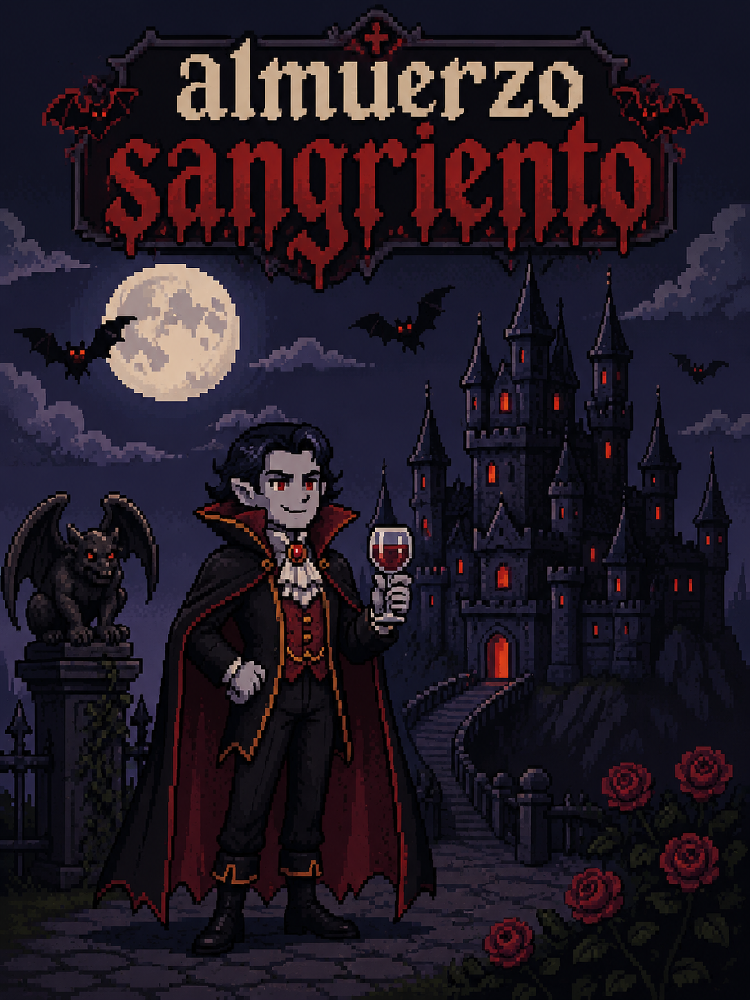
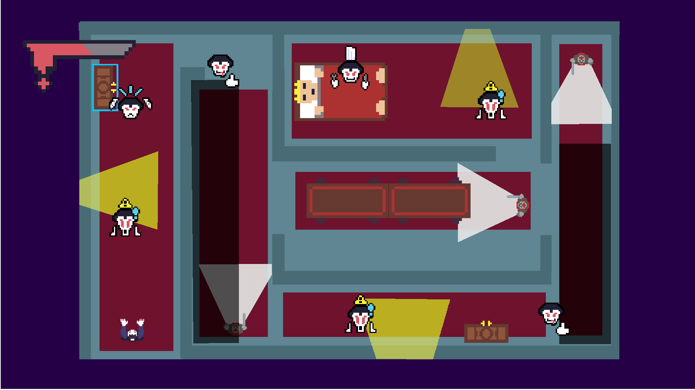
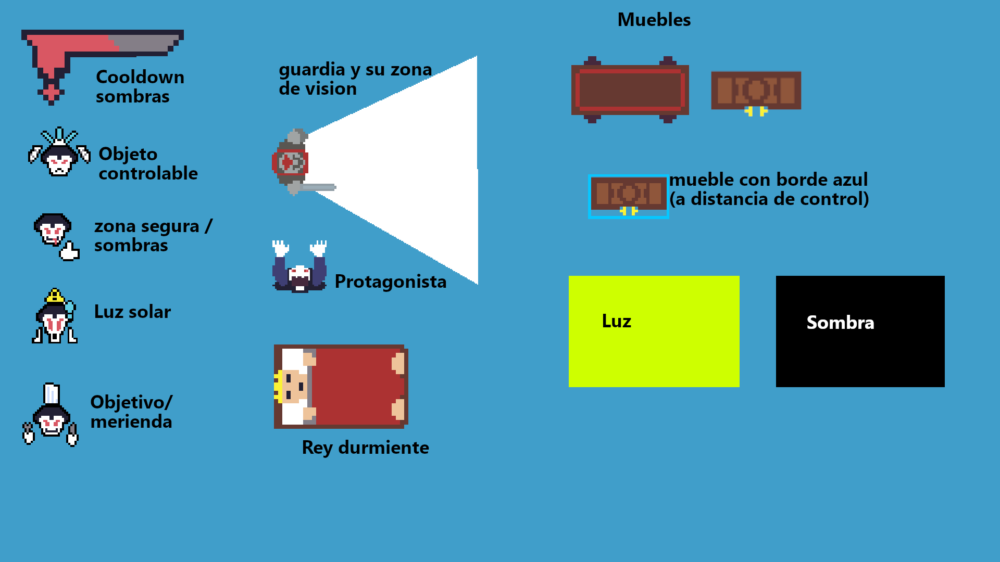
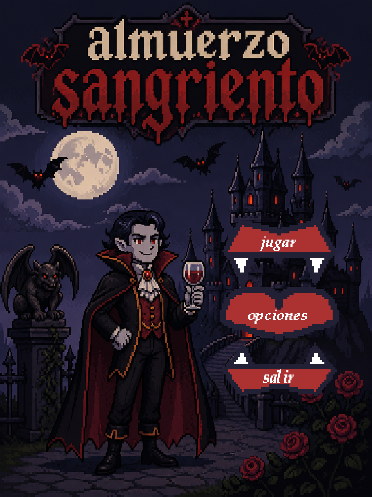

# UNIVERSIDAD NACIONAL DEL LITORAL
## Facultad de Ingeniería y Ciencias Hídricas
### Tecnicatura en Diseño y Programación de Videojuegos
**Proyecto Final**

---

# GAME DESIGN DOCUMENT (GDD)

**Nombre del Juego:** Almuerzo sangriento  
**Versión:** 1.5.0  
**Fecha de actualización:** 21/07/2026

## Ficha del Grupo
| Apellido y Nombre Completo | Función dentro del grupo |
| :--- | :--- |
| Angel Rios | Game Designer / Level Design |
| Angel Rios | Artist |
| Angel Rios | Programmer |
| Angel Rios | Producer |

---

## 1. High Concept y Visión Inicial

**High Concept:** Juego de sigilo Topdown Dungeon Crawler, donde un vampiro debe infiltrarse a varios castillos, asesinar a los guardias sin ser visto, usando y controlando el ambiente a su favor, evitando la luz del sol, para llegar al miembro real y devorarlo.

---

## 2. Estructura Core del Proyecto

### 2.1 Objetivo del Proyecto
El proposito educativo de este proyecto, es aprender a llevar acabo una idea simple y convertirla en un proyecto rentable y deseado por los jugadores. En cuanto al proposito como producto, mi videojuego busca demostrar que no se necesita un concepto gigante ni un equipo triple A para crear un buen producto.

### 2.2 Diseño e investigación
- **Definición de idea:** El jugador, encarnando a un vampiro, jugara varios niveles donde se desplazara del punto A al punto B, evitando ser descubierto por los enemigos, este dispone de sombras y muebles para cortar la vision de los guardias, estos muebles, que el usuario puede controlar mentalmente usando el mouse, tambien sirven para obstruir el otro obstaculo presente, la luz del sol. Al completar los 3 niveles de la demo, donde alcanzo su objetivo de eliminar a toda la familia, el jugador sera recompensado con la pantalla de victoria.
- **Género:** Sigilo, Dungeon Crawler, Puzzle.
- **Referencias:** LLLOOOT!,Vampire Skills, Castlevania 3, Meccha chameleon, algunos de estos juegos tratan sobre la mecanica de sigilo, otros se enfocan en la atmosfera de un juego centrado en vampiros.
- **Público objetivo:** Jugadores de entre 8 a 20 años, un publico mas juvenil y casual.
- **Mecánicas principales:** Esconderse en las sombras, controlar muebles con la mente para ocluir la vista de los guardias o bloquear la luz solar, asesinatos sigilosos por la espalda.

### 2.3 Concepto del Juego
Situado en la edad media, jugamos como el ultimo vampiro de un largo linaje, cuya familia fue derrocada por un cambio en los horarios de sueño. Los enemigos viven en un castillo, por lo que cada nivel constara de varias habitaciones conectadas adentro de este, donde el jugador debera usar el ambiente a su favor para evitar a los guardias en armadura. El objetivo principal, mencionado anteriormente, es asesinar a cada miembro de la familia real, para que el decreto del rey (que dormir la siesta los mantendra seguros) sea visto como una farsa, y la gente vuelva a la vida normal, y volver a ser presas de esta especie. El juego se desarrolla enteramente adentro del castillo, por lo que desarrollar el resto del reino no es necesario, pero este consta en su mayoria de pequeñas chozas conectadas por calles de piedra, y grandes bosques al limite de estas, creando un lugar perfecto para la caza de humanos.
Por otro lado, la razon por la que el joven vampiro sigue vivo, es que al ser el mas joven del clan, no tenia permitido cazar, sino que los mas grandes lo alimentaban. Al morir estos, el vampiro inexperto se ve obligado a crecer, y tomar rienda de su propio destino.

### 2.4 Premisas del Videojuego
Las reglas a tener en cuenta para desarrollar esta narrativa son:
- Los vampiros no pueden tocar la luz solar emanante de las ventanas, se considera Game Over instantaneo.
- Cualquier cosa que no este pegada al piso (Armarios, mesas, o librerias) puede ser movido con la mente al ser clickeados con el mouse, rotado al girar la rueda del mouse, y usado para bloquear la vista de los guardias y la luz solar.
- Las sombras vuelven invisible al vampiro, pero solo por un corto periodo de tiempo, seguido de un cooldown.
- Al asesinar al objetivo, el jugador avanza instantaneamente al siguiente nivel.
- El juego sucede de dia, ya que si el vampiro esperase a la noche, el objetivo se despertaria y seria imposible atacarlo. 

### 2.5 Condiciones del Desarrollo
El motor elegido sera Godot 4 en 2D. Se utilizara este repositorio de git, con una carpeta llamada desarrollo que contendra todos los archivos necesarios para la ejecución.
Por otro lado, la metodologia de trabajo, basada en programación orientada a objetos, se enfocara en que el jugador, obstaculos y enemigos sean funcionales primero, luego desarrollara el ambiente de juego de un nivel, y por ultimo se desarrollara el arte y la interfaz. Un juego de este tamaño, con una larga cantidad de elementos reutilizables, no deberia tardar mas de un par de meses (estimado 1 o 2), y al ser un estilo tan simple con arte pixel art, no deberia sufrir ningun tipo de limitaciones de hardware en computadoras modernas.

### 2.6 Alcance del proyecto
El trabajo que sera entregado, puede ser definido como una demo. El prototipo incluira 3 niveles, en los que tendriamos que eliminar a 3 objetivos, para demostrar plenamente como funcionaria el concepto. 
El juego empieza en el primer nivel, explicando la mecanica de sigilo y el objetivo. En el segundo le brindariamos al jugador la capacidad de mover los muebles con la mente, usando estos como barrera contra el sol y bloque visual contra los guardias, y en el tercero usariamos esos 2 elementos para eliminar al rey, completando la demostración.

---

## 3. Diseño Detallado del Juego

### 3.1 Elementos del Juego
- **Personaje principal:** Vampiro.
- **Enemigo:** Caballero haciendo guardia, un solo tipo de enemigo.
- **Muebles:** Mesa, armario, trono.
- **Escondites:** Sombras, detras de muebles.
- **Zonas de peligro:** Luz solar.
- **Objetivo:** Persona dormida.

### 3.2 Reglas
- El jugador solo puede controlar con el mouse un objeto a la vez, al encontrarse cerca y en vista directa de este.
- Los enemigos reaccionan al jugador, pero no le dan importancia a los muebles flotantes.
- El jugador camina a una velocidad fija, y no puede ser visto bajo ninguna condición.
- Los guardias tardan unos segundos en darse cuenta si el vampiro esta en frente de ellos, al ser visto, se considera Game Over.
- Los guardias solo pueden ser asesinados por la espalda, pero el objetivo, al encontrarse dormido, puede ser atacado desde cualquier dirección.
- Ocultar la luz no crea nuevas zonas de sombra, las zonas de sombra son fijas.
- El jugador gana el nivel automaticamente al tocar al objetivo.

### 3.3 Descripción de una sesión de juego
El usuario empieza la partida, y entra al nivel por una puerta, al ser topdown, puede ver todo el mapa desde el comienzo, empezara a desplazarse hacia el final del nivel tomando en cuenta la posición de los guardias. Al encontrarse al primer guardia notara que este se desplaza de un punto A a un punto B en un pequeño trayecto, tendra la opción de evitar su visión, esconderse entre las sombras, ocultarse detras de un obstaculo, o rodearlo y deshacerse de el. En cuanto a estos enfrentamientos, es posible resolverlos sin la necesidad de eliminar enemigos, pero esto seria mas complicado.
Al encontrarse con la luz solar, las opciones son similares, esquivarla, o taparla con muebles, pero el verdadero desafio viene cuando debemos evitar la luz y los guardias al mismo tiempo, ya que debemos centrar nuestra atención en uno de los 2. Una vez superado el recorrido, el jugador llegara al objetivo, lo atacara, y pasara de nivel. Al completar los 3 niveles de la demo, el juego terminara.

### 3.4 Estética y Experiencia del Jugador
Las emociones principales que se buscan emanar son tensión y desafio, manejar las rutas de los guardias mientras se evita el sol puede ser muy demandante para los jugadores mas novatos. La constante necesidad de mantenerse en movimiento es reemplazada con euforia al llegar a un lugar seguro y/o al objetivo principal. Este loop desafio recompensa es muy comun en los juegos de sigilo.
Al rejugar el videojuego, este desafio se ve reducido, ya que el jugador ya reconoce los patrones de movimiento, sin embargo, este juego puede generar esta euforia en modo de jugabilidad "Speedrun". El nuevo objetivo se convierte en ganar los niveles en el menor tiempo posible, o quizas ganarlo sin ser visto ninguna ves, o sin tener ningun error, asegurando asi mas horas de juego emocionantes. 

---

## 4. Arte, Audio y Bocetos

ilustración conceptual del gameplay.

Explicación sobre los componentes usados.

Ejemplo de menu de inicio

**Estilo Visual y Sonoro:** Usando una paleta de colores fria y tenebrosa (azules, violetas, rojos oscuros, negros, etc) implementariamos un estilo pixel art muy estilizado, usando una interfaz graciosa, donde los emojis indican el peligro, las herramientas a disposición y el objetivo. En cuanto a la musica, se desarrollaria en una aplicacion musical midi, usando sintetizadores brillantes para conseguir un sonido musical similar al de castlevania 3, y usando una aplicación de sfx, creariamos sonidos al estilo 8 bits para completar la sensación retro.
